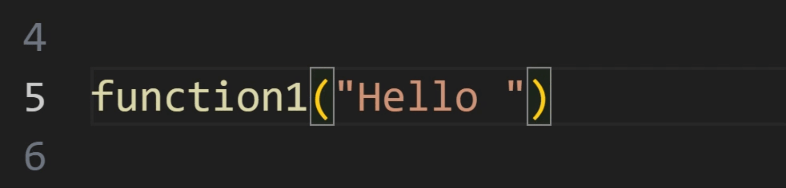

# Smart Brackets README

No more going to the end of the line before placing your semicolon or brackets!
 
You can easily write code without using your arrow keys like this:



(Extension is WIP: Input and code contributions are very welcome!!)

```js
let example = "placed semicolon;"
void placedBrackets ({}) // Not yet implemented
```

Using Smart Brackets this will automatically be replaced to this:

```js
let example "placed semicolon";
let placedBrackets () {} // Not yet implemented
```

Like you intended to! No more manually moving the cursor and no more mistakes because you forgot to use the arrow keys!


## Features

Currently Smart Brackets supports te following corrections:

### Typing detection

All below operations will only be applied when you're typing! When moving the cursor to the position and deliberately placing the character Smart Brackets won't mess up your code.

If you actually meant to place a character a certain way and Smart Brackets moved it to the wrong position, just press ctrl + z (undo) to keep it your way.

### Semicolon in string correction

```js
// User placed
let example = "semicolon;"
example('semicolon;')
// Smart Brackets correction
let example = "semicolon";
example('semicolon');
```

### Semicolon in parenthesis correction

```js
// User placed
example(;)
// Smart Brackets correction
example();
```

Other operations are W.I.P.


## Extension Settings

Every feature can be turned on or off in the settings.
Currently the following settings are available:

*Please check the "Feature contributions" tab on this page*

## Known Issues

Please check all our issues on [GitHub](https://github.com/VasilVerdouw/smart-brackets/issues).

## Contribution

All contributions are welcome and appreciated!

Please contribute new features on [GitHub](https://github.com/VasilVerdouw/smart-brackets).

Check out the [CONTRIBUTING](https://github.com/VasilVerdouw/smart-brackets/blob/main/CONTRIBUTING.md) file for more information.
